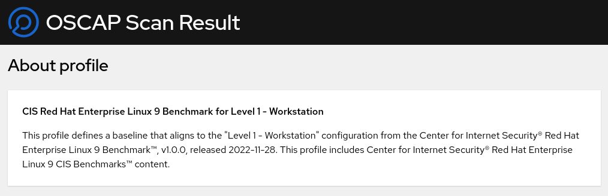
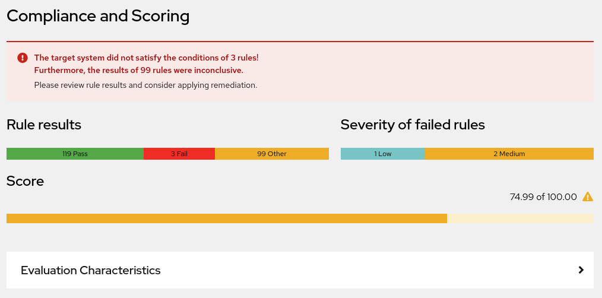
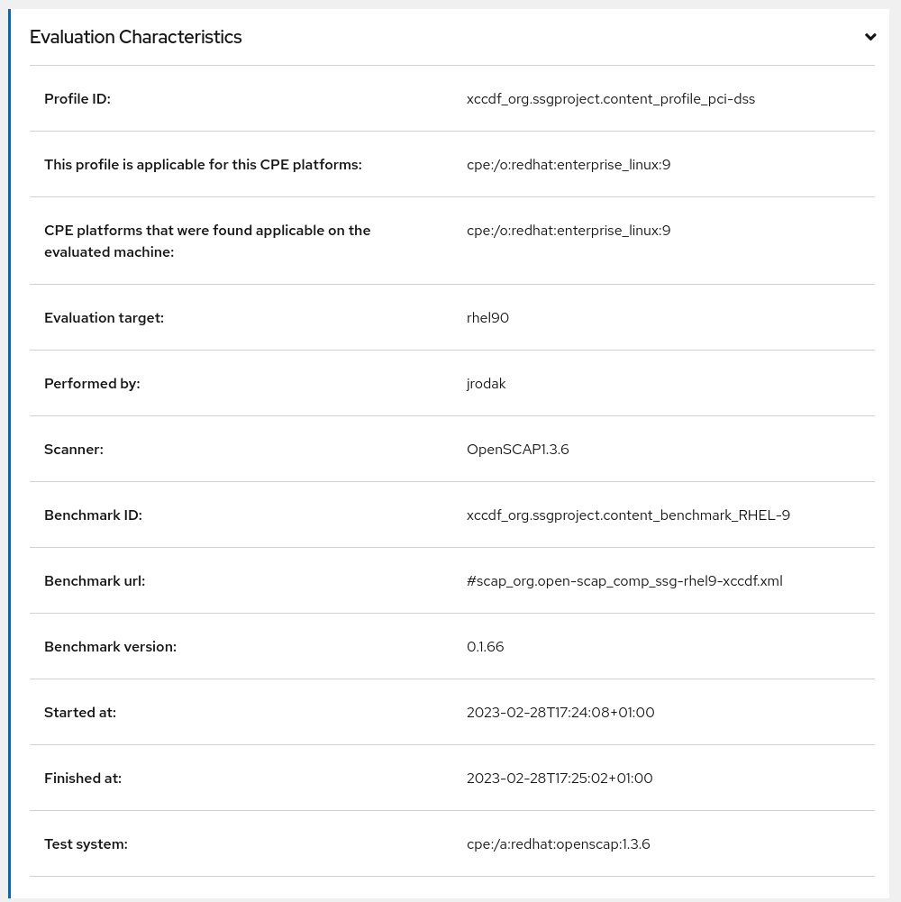
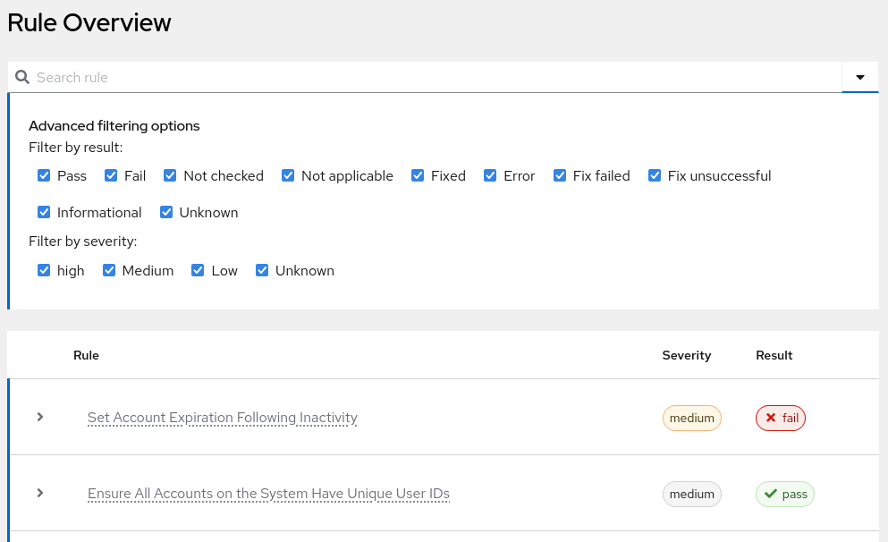
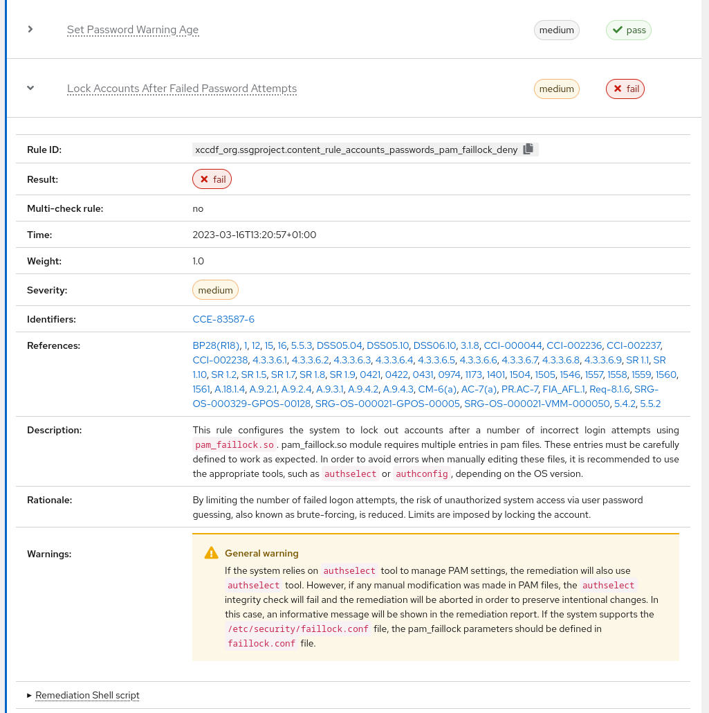
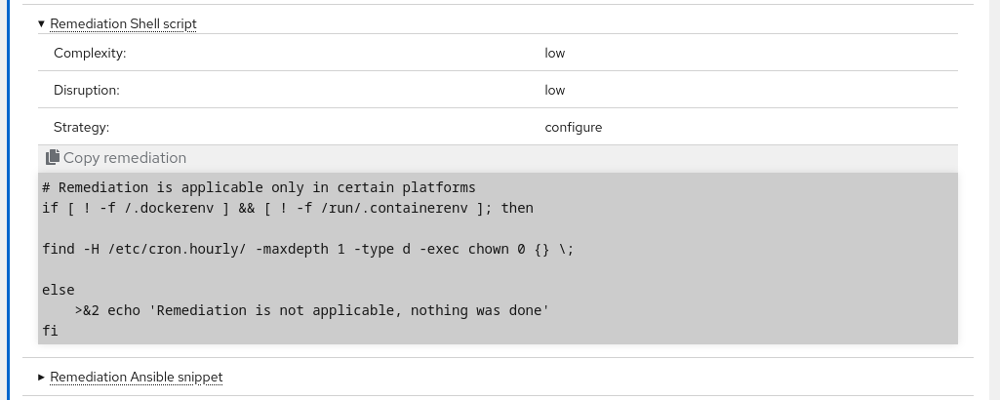
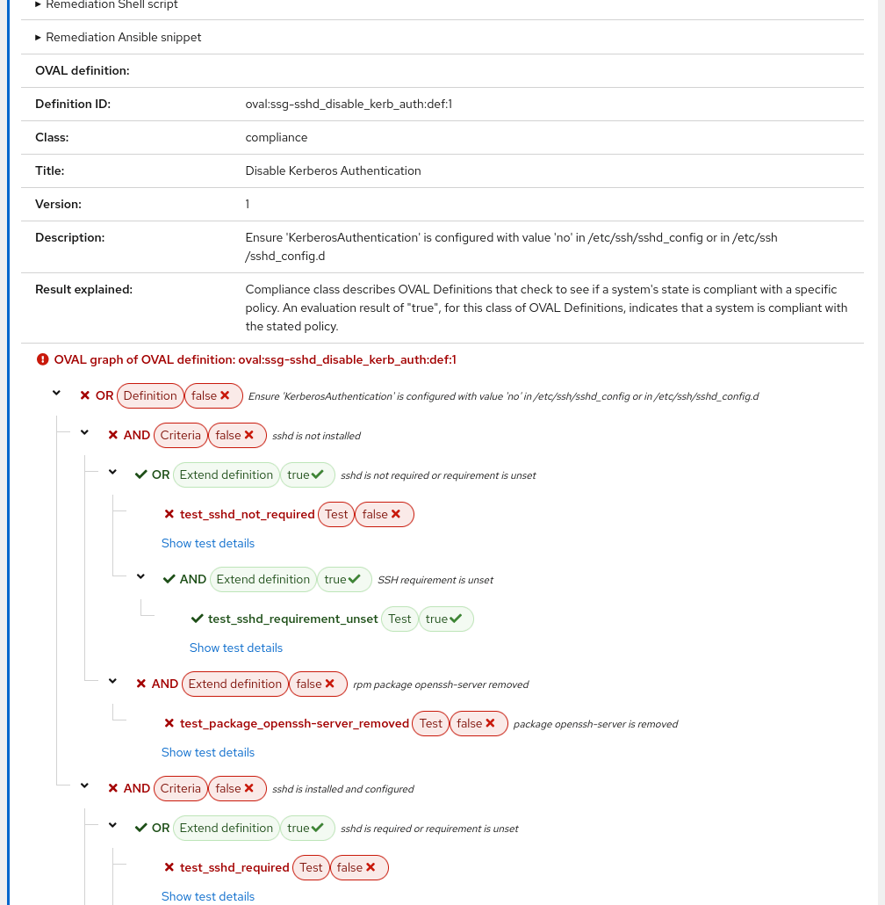
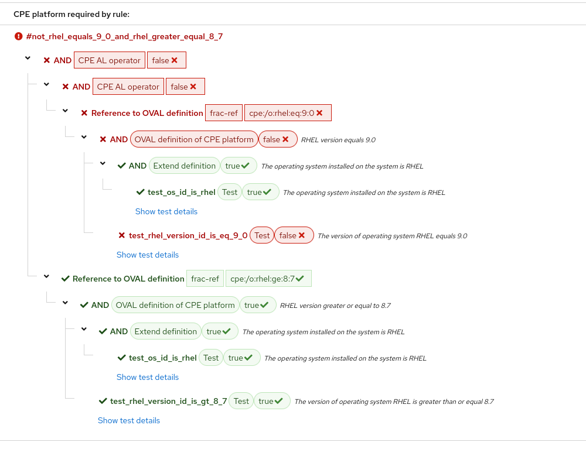

Report Content
==============

.. _content_of_report:

The generated report consists of several parts. A real example of the generated report is available :download:`here <assets/example_report.html>`.

About profile
-------------
The first part contains the description and name of the selected profile.

Compliance and Scoring
----------------------
This section contains overall statistics and information about the scan performed.
For example, pass and fail rule counts, scan score, scan summary, etc.

Information about the performed scan is hidden under the drop-down section Evaluation Characteristics.
You can reveal the Evaluation Characteristics by clicking on the white "Rating Characteristics" box.

Rule Overview
-------------
This section lists all the rules that were included in the profile.
The list of rules can be searched by rule identifier or rule title.
The list of rules can also be filtered by rule result and severity.
You can view advanced filtering options by clicking the arrow on the right side of the search bar.

Information about rule
______________________
The rule information is hidden in the detailed rule. This information can be viewed by clicking the rule title or the arrow to the left of the rule title.

In the bottom part of the rule detail, you can see the detail of the remediation.
You can view the detail of a specific remediation by clicking on the type of remediation, which is underlined with dots.

    
Below the remediation is the OVAL definition of the rule check with an interactive visualization of the check written in the OVAL language.

Underneath the OVAL definition is an interactive visualization of the CPE platform check that can combine CPE applicability and the OVAL language.

